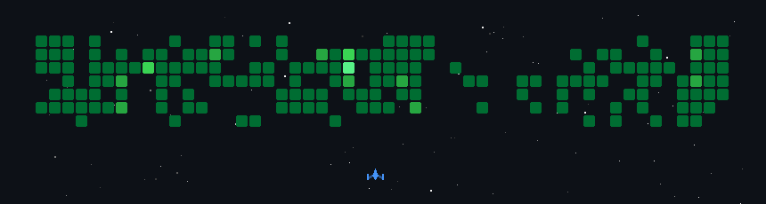

<div align="center">


# Hola, soy Michael González 👋

### Full Stack Developer · AWS Cloud Developer

Desarrollo aplicaciones web, microservicios y soluciones cloud mantenibles, con especial interés en arquitectura serverless, calidad de código y productos que resuelven problemas reales.

[](https://github.com/qwery2052)
[](https://www.linkedin.com/in/myth-dev/)
[](https://www.npmjs.com/~mything)
[](https://marketplace.visualstudio.com/publishers/mythDev)


</div>

## Sobre mí

- 💻 Más de **7 años de experiencia** en tecnología y desarrollo de software.
- ☁️ Construyo e integro soluciones en **AWS**, con enfoque en arquitecturas serverless y microservicios.
- 🧩 Trabajo de extremo a extremo con **backend, frontend, bases de datos e infraestructura cloud**.
- 🧭 He liderado equipos, definido arquitecturas, establecido estándares de código y acompañado a otros desarrolladores.
- 🌎 Tengo experiencia colaborando de forma remota con equipos de **LATAM, India y Australia**.
- 🐈 Amante de los gatos; creo firmemente que todo buen despliegue merece supervisión felina.

## En qué trabajo actualmente

- Desarrollo de microservicios y flujos en AWS.
- Integración de capas de acceso a datos relacionales y NoSQL.
- Optimización técnica de infraestructura, rendimiento y costos cloud.
- Configuraciones y despliegues consistentes con CloudFormation y Systems Manager.
- Comunicación técnica diaria en inglés dentro de equipos multiculturales.

## Tecnologías

### Cloud y backend

<p>
  
</p>

### Frontend

<p>
  
</p>

### Datos, herramientas y DevOps

<p>
  
</p>

También trabajo con SQL Server, REST APIs, API Gateway, Lambda, S3, CloudWatch, SSM, CI/CD, PrimeNG, Ant Design, Scrum, principios SOLID y Clean Code.

## Mi enfoque profesional

```text
Ideas claras → arquitectura simple → código mantenible → despliegues confiables
```

Me gusta transformar necesidades complejas en soluciones comprensibles. Busco un equilibrio entre velocidad de entrega, buena arquitectura y facilidad de mantenimiento, sin sobreingeniería.

## Trayectoria destacada

- **Amaris Consulting** — Full Stack / Backend AWS Developer.
- **Universidad Surcolombiana** — Tech Lead y Coordinador de Proyecto.
- **Borg Financial (Australia)** — Full Stack Developer freelance.
- **Proyecto KWEKWE NEJ'WESX** — Frontend Developer con React y Next.js.
- Experiencia previa coordinando infraestructura, soporte corporativo, servidores y bases de datos.

## Formación

- 🎓 Ingeniería de Sistemas.
- 🎓 Tecnología en Análisis y Desarrollo de Sistemas de Información.
- 🎓 Técnica en Análisis y Diseño de Bases de Datos.
- 📚 Diplomado en Analítica de Datos y Big Data.
- 📚 Diplomado en Programación PHP.
- ☁️ Formación en AWS Cloud Practitioner.

<!-- space-shooter:start -->

## Mi actividad en modo Space Shooter 🚀



[Generado con gh-space-shooter](https://github.com/czl9707/gh-space-shooter).

<!-- space-shooter:end -->

## GitHub

<div align="center">


<br/>


</div>

> Parte de mi experiencia profesional está en repositorios privados; aquí iré compartiendo proyectos, herramientas y aprendizajes que puedan ser útiles para otros desarrolladores.

<div align="center">

### Gracias por visitar mi perfil


<sub>Construyendo soluciones, aprendiendo constantemente y corrigiendo bugs bajo supervisión felina.</sub>

</div>
